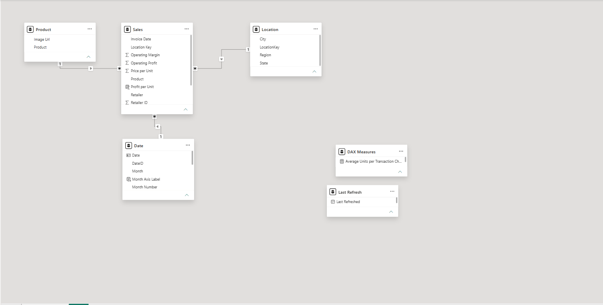
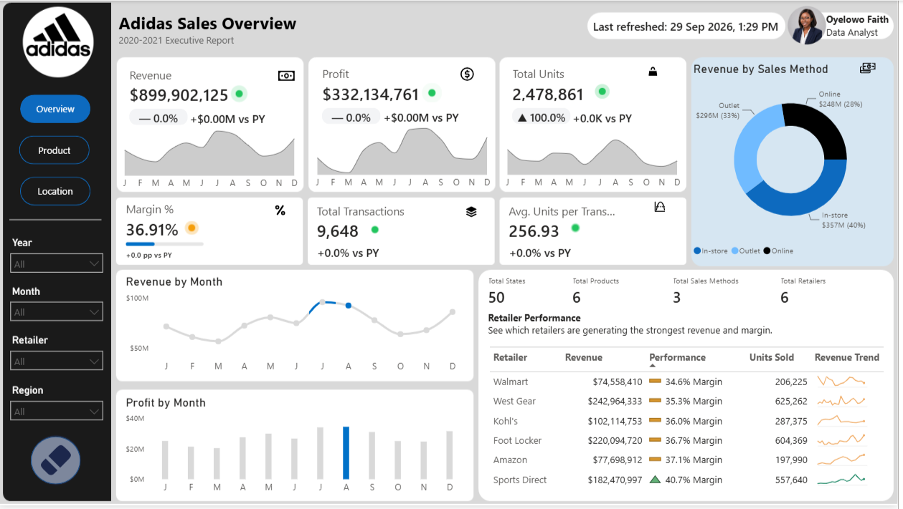
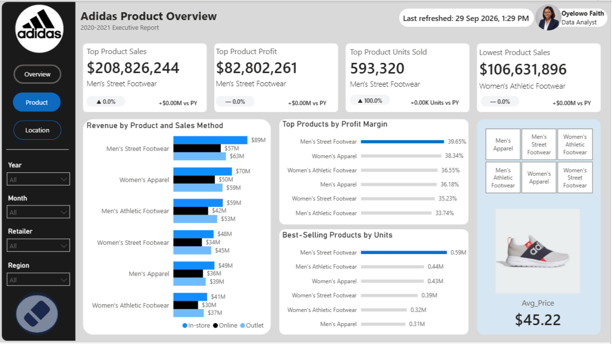
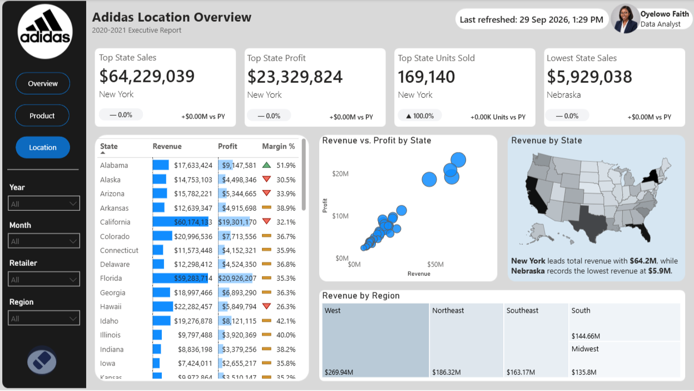

# Adidas Sales Analysis

## Table of Contents
- [Project Overview](#project-overview)
- [Business Problem](#business-problem)
- [Business Questions](#business-questions)
- [Tools and Skills](#tools-and-skills)
- [Dataset](#dataset)
- [Data Preparation](#data-preparation)
- [Data Modeling](#data-modeling)
- [Dashboard](#dashboard)
- [Key Findings](#key-findings)
- [Recommendations](#recommendations)

## Project Overview

This project analyses retail sales, product category profitability, regional trends, and distribution channels for Adidas across the United States from 2020 to 2021. Built in Power BI using an import data model, the interactive dashboard helps retail leadership and sales managers understand revenue drivers, compare sales methods, evaluate product profitability, and identify geographic performance variations to support strategic commercial decisions.

## Business Problem

Adidas needs visibility into overall revenue, profit margins, sales channels, product categories, and geographic region performance across its retail partner network. Without a centralized, interactive analytics tool, stakeholders struggle to assess which product lines generate optimal profit margins, which channels perform best, and where sales are underperforming across states and cities.

## Business Questions

- What is the total revenue, total profit, operating margin percentage, total units sold, and average units per transaction across the business?
- How do different sales methods (In-store, Outlet, Online) compare in revenue generation and volume?
- Which retail partners drive the highest overall revenue, margin, and unit sales?
- Which product categories generate the highest total revenue, profit, unit volume, and profit margin?
- How do revenue and profit vary across geographical regions, states, and cities?

## Tools and Skills

- **Power BI Desktop**
- **Power Query**
- **Data Modeling** (Star schema, relationships, cardinality)
- **DAX** (Measures for totals, averages, and KPIs)
- **Dashboard Development**
- **KPI Development**
- **Slicers and Filters** (Year, Month, Retailer, Region)
- **Data Visualisation** (Bar charts, Donut chart, Map, Matrix/Table, Cards)

## Dataset

The dataset covers Adidas US sales records from 2020 to 2021. The main transaction data table consists of 9,648 rows.

- **Dataset name:** [Adidas Sales Dataset](https://www.kaggle.com/datasets/afzashaikh/adidas-sales-dataset)
- **Reporting period:** 2020 – 2021
- **Number of rows:** 9,648 rows (Sales table)
- **Number of columns:** 12 columns (Sales table)
- **Important fields:** Retailer, Retailer ID, Invoice Date, Location Key, Product, Price per Unit, Units Sold, Total Sales, Operating Profit, Operating Margin, Sales Method
- **Record representation:** Each record represents an individual sales transaction/invoice line specifying product sales details, price, quantity, retailer, and location.

## Data Preparation

- Imported the provided dataset into Power BI Desktop using Import mode.
- Reviewed the dataset structure, column names, data types, and data quality before analysis.
- Verified and adjusted data types where required.
- Reviewed the existing Sales, Product, and Location tables provided for the project.
- Assigned appropriate data categories where required, including Image URL for product visual representation.
- Organized calculated measures within the dedicated DAX Measures table.

## Data Modeling

The reporting model uses a Star Schema structure centered around a primary fact table (`Sales`) linked to dimension tables (`Product`, `Location`, and `Date`) alongside supporting tables.

- **Fact Table:** `Sales` (contains transaction metrics: Units Sold, Total Sales, Operating Profit, Price per Unit, Operating Margin)
- **Dimension Tables:** `Product`, `Location`, `Date`
- **Relationship Keys:** `Product`, `LocationKey`, `Invoice Date` / `Date`
- **Cardinality:** Many-to-One (`*:1`) pointing from `Sales` to each respective dimension table.
- **Disconnected Supporting Tables:** `DAX Measures` (holds calculated measures like Average Units per Transaction) and `Last Refresh`

### Data Model Relationships

- **Sales to Product:** Many-to-One (`*:1`) relationship linked on the `Product` field.
- **Sales to Location:** Many-to-One (`*:1`) relationship linked on `LocationKey`.
- **Sales to Date:** Many-to-One (`*:1`) relationship linked on `Invoice Date` to `Date`.

## Dashboard

The Adidas Sales Analysis dashboard provides an interactive executive overview across sales metrics, channel distributions, product line performance, and spatial geographic analysis.

### View the Interactive Dashboard

View the live dashboard [here](https://app.powerbi.com/view?r=eyJrIjoiMjQ0Y2M5NTktZTE5Yi00NGVmLWIyYWYtNzUyMDg1NjZlYWE0IiwidCI6IjkyY2FlZjYwLWU2NzEtNDRmMC1iMzMxLWI0YTQ4MmFjMjk2YiJ9)

### Dashboard Pages

#### Sales Overview

This page provides executive summary metrics including revenue, profit, margins, transaction volume, sales method breakdown, and top-performing retailer performance.

#### Product Page

This page analyses product category sales, profit levels, volume sold, profit margins, and sales method breakdown by product line.

#### Location Page

This page evaluates sales performance across geography, highlighting revenue, profit, units sold, and margins across US states and regions.

## Key Findings

- **Total Revenue and Profit:** Total revenue reached **$899,902,125** with a total profit of **$332,134,761**, operating at an overall margin of **36.91%**.
- **In-Store Sales Dominance:** In-store sales represent the largest revenue share by channel at **40% ($356.64M)**, followed by Outlet at **39% ($349.02M)** and Online at **21% ($194.24M)**.
- **Top Product Line:** **Men's Street Footwear** generated the highest total product sales (**$208,826,244**), highest profit (**$82,802,261**), and highest volume sold (**593,320 units**).
- **Highest Profit Margin Product:** **Men's Street Footwear** achieved the highest profit margin among product lines at **39.65%**, whereas Men's Athletic Footwear posted the lowest at **33.74%**.
- **Top and Bottom Performing States:** **New York** led all states in total revenue (**$64,229,039**), profit (**$23,329,824**), and units sold (**169,140**), whereas **Nebraska** posted the lowest state sales revenue at **$5,929,038**.
- **Regional Sales Distribution:** The **West** region achieved the highest total revenue (**$269.94M**), outperforming the Northeast ($186.32M), Southeast ($163.17M), South ($144.66M), and Midwest ($135.80M).

## Recommendations

- **Expand High-Margin Product Lines:** Increase marketing and stock allocation for Men's Street Footwear due to its market-leading total profit ($82.8M) and top operating margin (39.65%).
- **Address Low-Margin Categories:** Review pricing strategies or supplier costs for Men's Athletic Footwear to improve its bottom-ranking profit margin of 33.74%.
- **Digital Channel Growth:** Invest in online sales channel initiatives, as Online currently accounts for only 21% ($194.24M) of total revenue compared to In-store ($356.64M) and Outlet ($349.02M).
- **Regional Expansion in Underperforming Areas:** Re-evaluate distribution and marketing strategies in lower-performing states like Nebraska ($5.9M) and the Midwest region ($135.8M) to replicate successful playbooks from top areas like New York ($64.2M) and the West region ($269.94M).